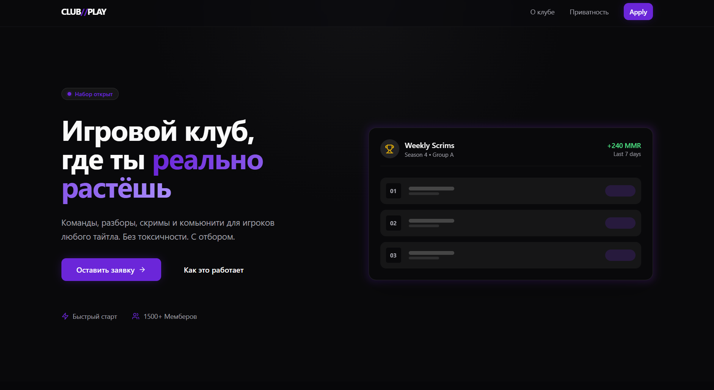
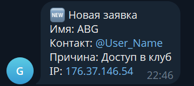

# Club Play — Premium Gaming Community Landing

**Live Demo:** https://game-land-x77l.vercel.app

Modern landing page for a premium gaming community with a secure serverless lead capture flow.
Built as a **portfolio demo project** to demonstrate production-ready frontend + backend skills.

---

## Table of Contents

- [Overview](#overview)
- [Features](#features)
- [Tech Stack](#tech-stack)
- [Architecture](#architecture)
- [Screenshots](#screenshots)
- [Local Development](#local-development)
- [Setup Instructions](#setup-instructions)
- [Deployment](#deployment)
- [Project Status](#project-status)

---

## Overview

This project represents a real-world, production-ready landing page with:
- Application-based onboarding (no open registration)
- Bot and spam protection (multi-layer)
- Server-side validation
- Real database storage (Supabase PostgreSQL)
- Instant admin notifications (Telegram)
- Secure serverless backend (Vercel)

The goal is not just UI, but a **complete, deployable product** ready for immediate use.

---

## Features

- **Modern UI**: Clean, product-style design with a 2026 aesthetic
- **Mobile-first**: Fully responsive layout for all devices
- **Application Form**: Structured lead capture with validation
- **Multi-layer Security**:
  - Cloudflare Turnstile (CAPTCHA alternative)
  - Rate limiting via Upstash Redis
  - Honeypot field for bot detection
- **Serverless Backend**: Vercel Functions with zero maintenance
- **Database**: Supabase PostgreSQL for persistent storage
- **Real-time Notifications**: Telegram alerts on new leads
- **Production Ready**: Deployed and fully operational

---

## Tech Stack

### Frontend
- **Vite** — Fast build tool and dev server
- **React** — UI library
- **TypeScript** — Type safety and developer experience
- **Tailwind CSS** — Utility-first styling

### Backend
- **Vercel Serverless Functions** — API endpoints
- **Supabase (PostgreSQL)** — Database and storage

### Security & Protection
- **Cloudflare Turnstile** — Bot protection
- **Upstash Redis** — Rate limiting
- **Server-side Validation** — Input sanitization
- **Service Role Isolation** — Database access control

### Infrastructure
- **Vercel** — Hosting, CI/CD, and automatic deployments
- **GitHub** — Version control

---

## Architecture

```
User
 └─> Landing Page (React + Vite)
      └─> Cloudflare Turnstile verification
           └─> /api/lead (Vercel Serverless Function)
                ├─> Rate limit check (Upstash Redis)
                ├─> Input validation & sanitization
                ├─> Database insert (Supabase)
                └─> Telegram notification (Admin)
```

**Data Flow:**
1. User fills out the application form
2. Turnstile CAPTCHA verification occurs
3. Form is sent to `/api/lead` endpoint
4. Server checks rate limits (prevents spam)
5. Data is validated and stored in PostgreSQL
6. Admin receives Telegram notification

---

## Screenshots

| Section | Screenshot |
|---------|-----------|
| **FAQ Section** |  |
| **Application Forms** |  |
| **Success State** |  |
| **Homepage** |  |
| **Telegram Notifications** |  |

---

## Local Development

### Prerequisites
- Node.js 18+ and npm
- A GitHub account (for version control)
- Supabase account (free tier works)
- Cloudflare account (free tier)
- Upstash account (free tier)

### Installation & Running

```bash
# Clone and install dependencies
npm install

# Start development server
npm run dev
```

The application will run on `http://localhost:5173` (Vite default).

### Create `.env.local` File

Create a `.env.local` file in the project root with the following variables:

```env
# Supabase
SUPABASE_URL=https://your-project.supabase.co
SUPABASE_SERVICE_ROLE_KEY=your-service-role-key

# Cloudflare Turnstile
VITE_TURNSTILE_SITE_KEY=your-turnstile-site-key
TURNSTILE_SECRET_KEY=your-turnstile-secret-key

# Upstash Redis (Rate Limiting)
UPSTASH_REDIS_REST_URL=your-upstash-url
UPSTASH_REDIS_REST_TOKEN=your-upstash-token
```

> **⚠️ Important:** Never commit `.env.local` to version control. Add it to `.gitignore`.

---

## Setup Instructions

### ✅ Supabase Setup

1. Create a new project at [supabase.com](https://supabase.com)
2. Go to **SQL Editor** and run the following:

```sql
CREATE EXTENSION IF NOT EXISTS pgcrypto;

CREATE TABLE public.leads (
  id UUID PRIMARY KEY DEFAULT gen_random_uuid(),
  created_at TIMESTAMPTZ NOT NULL DEFAULT NOW(),
  name TEXT NOT NULL,
  contact TEXT NOT NULL,
  reason TEXT NOT NULL,
  message TEXT NULL,
  source TEXT NOT NULL DEFAULT 'landing',
  user_agent TEXT NULL,
  ip TEXT NULL
);

-- Enable Row-Level Security
ALTER TABLE public.leads ENABLE ROW LEVEL SECURITY;

-- No public insert policies
-- Writes are allowed only via serverless functions using the service role
```

3. Get your credentials:
   - **SUPABASE_URL**: From Settings > API
   - **SUPABASE_SERVICE_ROLE_KEY**: From Settings > API (use the Service Role key, not the public key)

### ✅ Cloudflare Turnstile Setup

1. Create a Turnstile site at [dash.cloudflare.com](https://dash.cloudflare.com)
2. Add your domain and select "Managed" mode
3. Copy your credentials:
   - **VITE_TURNSTILE_SITE_KEY**: Public key
   - **TURNSTILE_SECRET_KEY**: Secret key

### ✅ Upstash Redis Setup

1. Create a Redis database at [upstash.com](https://upstash.com)
2. Copy credentials:
   - **UPSTASH_REDIS_REST_URL**: REST endpoint
   - **UPSTASH_REDIS_REST_TOKEN**: Authentication token

---

## Deployment

### Deploy to Vercel (Recommended)

1. Push your code to GitHub
2. Connect your repository to [Vercel](https://vercel.com)
3. Add environment variables in Vercel project settings
4. Deployment is automatic on every push to `main`

**Production URL:**
```
https://game-land-x77l.vercel.app
```

### Environment Configuration

Ensure all environment variables are set in:
- **Local development**: `.env.local` file
- **Vercel production**: Project Settings > Environment Variables

---

## Project Status

✅ **Production Ready**
- All core features implemented
- Security measures in place
- Database integrated and tested
- Deployed and live
- Portfolio demo project suitable for showcasing

### Features Completed
- Modern responsive UI
- Secure serverless backend
- Multi-layer bot protection
- Rate limiting system
- Email/contact lead capture
- Admin notifications
- Production deployment

---

## What This Project Demonstrates

- Full-stack development skills (frontend + backend)
- Security best practices (validation, rate limiting, CAPTCHA)
- DevOps knowledge (serverless, CI/CD, environment management)
- Database design (PostgreSQL, RLS)
- Modern tooling (Vite, TypeScript, Tailwind CSS)
- Production deployment and monitoring

---

## License

This is a portfolio demo project. Feel free to use it as a reference or template for your own projects.

---

**Last Updated:** January 2026
